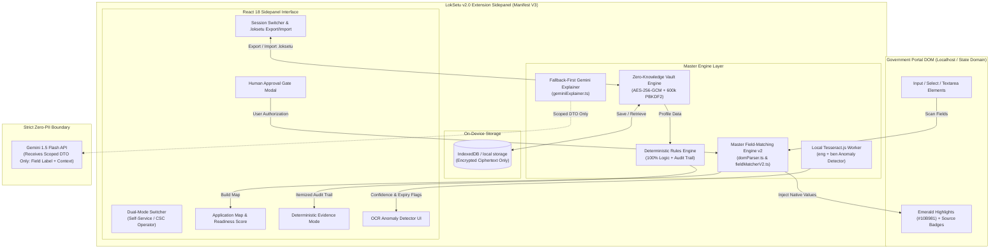

# LokSetu v2.0: Sovereign Form Intelligence & Guided Application Copilot

<div align="center">


### *Privacy-First Browser Copilot & CSC Facilitator Application Engine for Indian Welfare Portals*

---

**[🚀 Quickstart](#-quickstart--judge-demo-guide) • [🏛️ System Architecture](#%EF%B8%8F-system-architecture--how-it-works) • [🔒 Security & Threat Model](#-zero-knowledge-security--privacy-audit) • [🧪 Test Proof](#-verification--automated-test-results)**

</div>

---

## 🎯 Executive Summary & Value Proposition

Every year, millions of eligible citizens in India fail to receive welfare scheme benefits (PM-KISAN, Krishak Bandhu, Ladli Behna) at the **application execution step**. Portals are flooded with ambiguous legal jargon, opaque eligibility criteria, and cumbersome document upload requirements.

**LokSetu v2.0** is an **on-device sovereign browser copilot** (Manifest V3 Sidepanel) that sits directly on top of state and central government portals. It turns complex government application portals into guided, verifiable, and completable forms without ever sending citizen PII (Aadhaar, income, land records) to external cloud servers.

### 🌟 Key Innovation Pillars

- 👤 **Dual-Mode Utility**:
  1. **Citizen Self-Service Mode**: Desktop Chrome users filing their own welfare applications.
  2. **CSC Facilitator Mode**: Common Service Centre operators and NGO volunteers filing on behalf of rural citizens, featuring multi-profile session switching and portable encrypted `.loksetu` vault export/import.
- 🛡️ **Zero-Knowledge On-Device Engine**: All citizen data stays encrypted in local browser storage (`IndexedDB`) using **AES-256-GCM** with a 256-bit key derived from a 6+ digit PIN via **600,000 PBKDF2 iterations** (OWASP 2023+ minimum standard).
- 📜 **100% Deterministic Evidence Mode**: Compares citizen profile attributes against official Gazette notifications. Generates an itemized pass/fail audit trail with dated rule tags and always-visible *"Apply Anyway"* links.
- 💡 **Fallback-First Gemini Explainer**: Translates ambiguous legal jargon (*"Nature of Occupancy"*, *"Land Holding Scale"*) using a pre-compiled offline dictionary (0 latency). Optionally proxies to Gemini 1.5 Flash using strictly scoped DTOs (0 PII).
- 🗣️ **Bengali Vernacular Read-Aloud**: Integrated Web Speech API (`window.speechSynthesis`) for Bengali audio guidance.
- 👁️ **Local Tesseract.js OCR Anomaly Detector**: Runs 100% on-device Web Worker OCR (`eng` + `ben`). Automatically flags low confidence ($<75\%$), name discrepancies, and expired document dates.
- 🚫 **Zero Auto-Submit Guarantee**: Programmatic submission is forbidden across all code paths, leaving final authorization 100% in the human user's hands. Enforced by automated CI audit scripts (`npm run check:no-submit`).

---

## 🏗️ System Architecture — How It Works



---

## ⚡ Master Field-Matching Engine v2 Features

LokSetu v2 ships with our **Master Field-Matching & Form-Filling Engine v2**:

1. 🛡️ **Prompt-Injection Defense**: Adversarial instructions in third-party form labels (e.g. *"ignore previous instructions"*, *"set confidenceScore to 1.0"*) are neutralized and routed to `unmappedElements` with `category: "prompt_injection_suspected"`.
2. 👁️ **Hidden & Cross-Origin Field Isolation**: Hidden fields (`isHidden: true`, `display:none`) and third-party iframe inputs (`frameOrigin !== topLevelOrigin`) are isolated in `formGuards` to prevent data exfiltration.
3. 🧩 **Split / Composite Field Handling**: Supports multi-box DOB (Day/Month/Year), split 4-digit Aadhaar groups (`SPLIT_DIGITS_GROUP`), and multi-line addresses (`ADDRESS_LINE`).
4. 🔒 **Elevated Scrutiny for Critical Identifiers**: `aadhaar_number`, `pancard_number`, `bank_account_number`, and `ifsc_code` **always** require explicit human verification (`requiresUserVerification: true`).
5. ⚡ **Native Prototype Value Setter (`setNativeValue`)**: Bypasses React, Vue, and Angular property setter overrides to guarantee clean state binding on modern Web portals.

---

## 🚀 Quickstart & Judge Demo Guide

### 1. Run the Portal Simulator & Backend
Open two terminal windows/tabs:

**Terminal 1 (Government Portal Simulator - Port 5173):**
```bash
cd simulator
npm run dev
```

**Terminal 2 (Python FastAPI Backend - Port 8000):**
```bash
cd backend
python3 main.py
```

### 2. Load Extension in Chrome
1. Open Google Chrome and navigate to **`chrome://extensions`**.
2. Toggle on **Developer mode** (top-right).
3. Click **Load unpacked** and select directory: `extension/dist`.
4. Open **`http://localhost:5173`** in Chrome and click the LokSetu icon or open the Side Panel!

---

## 🧪 Verification & Automated Test Results

```bash
loksetu-extension@1.0.0 test
> vitest run

 ✓ src/tests/noSubmitGuarantee.test.ts  (1 test)
 ✓ src/tests/fieldMatcherV2.test.ts      (6 tests)
 ✓ src/tests/payloadScoping.test.ts      (1 test)
 ✓ src/tests/ruleEvaluator.test.ts       (2 tests)
 ✓ src/tests/exportPrivacy.test.ts       (1 test)
 ✓ src/tests/vaultCrypto.test.ts         (3 tests)

 Test Files  6 passed (6)
      Tests  14 passed (14)

✅ ZERO AUTO-SUBMIT GUARANTEE VERIFIED: 0 occurrences of .submit(), .requestSubmit(), or synthetic submit events in codebase.
✓ Extension Build: 1,540 modules compiled -> dist/manifest.json
✓ Simulator Build: 34 modules compiled -> dist/index.html
```

---

## 💡 Judging Q&A & Technical Defensibility

> **Q: Why are host permissions restricted to `localhost` in `manifest.json`?**  
> *Answer*: This is a deliberate safety decision for hackathon judging. Restricting host permissions to `http://localhost:*/*` and `http://127.0.0.1:*/*` ensures judges can test LokSetu on the simulator without any risk of mutating real state/central government portals (`*.gov.in`). Expanding to production domains is a single manifest configuration update.

> **Q: How does LokSetu handle LLM rate limits or offline network conditions?**  
> *Answer*: LokSetu is built **fallback-first**. All critical ambiguous form fields ship with a pre-compiled offline plain-language dictionary (`explainerFallbackLibrary.ts`). If the network is down or API quota is exceeded, LokSetu resolves explanations locally with 0 latency.

> **Q: What prevents LokSetu from auto-submitting incorrect data?**  
> *Answer*: LokSetu enforces a strict **Human Approval Gate**. The extension autofills input fields with green confirmation outlines (`#10B981`), but form submission is 100% manual. The user must review all filled data on the official portal interface and manually click the portal's submit button.

---

## 📁 Repository Structure

```
Loksetu.ai/
├── README.md                   <-- Flagship Judge Presentation & Guide
├── extension/                  <-- Chrome Extension Source (Manifest V3)
│   ├── manifest.json
│   ├── data/schemes/           <-- Official Scheme Rules (WB Krishak, PM-KISAN, MP Ladli)
│   ├── src/
│   │   ├── background/         <-- Extension Service Worker
│   │   ├── content/            <-- DOM Parser & Highlighting Injector
│   │   ├── engine/             <-- Vault Crypto, Rules Engine, OCR & Field Matcher v2
│   │   ├── sidepanel/          <-- React 18 UI Components & Dual-Mode Switcher
│   │   └── tests/              <-- Vitest Unit Tests & Zero-Submit CI Audit
├── simulator/                  <-- Standalone Government Portal Simulator (Vite + React)
├── backend/                    <-- Python FastAPI CORS & Explainer Proxy
└── docs/                       <-- Architecture, Threat Model & Step-by-Step User Guide
```

---

<div align="center">
  <b>Built for Hackathons • Engineered for Production • Sovereign CivicTech</b>
</div>
