# LokSetu v2.1: Sovereign Form Intelligence & Guided Application Copilot ("God Mode")

<div align="center">


### *Privacy-First Browser Copilot & CSC Facilitator Application Engine for Indian Welfare Portals*

---

**[🚀 Quickstart](#-quickstart--judge-demo-guide) • [⚡ What's New in v2.1](#-whats-new-in-v21-god-mode) • [🏛️ System Architecture](#%EF%B8%8F-system-architecture--how-it-works) • [🔒 Security & Threat Model](#-zero-knowledge-security--privacy-audit) • [🧪 Test Proof](#-verification--automated-test-results)**

</div>

---

## ⚡ What's New in v2.1 ("God Mode")

LokSetu v2.1 closes 6 critical architectural & operational gaps to create an unassailable hackathon moat:

1. 📜 **Verifiable Gazette Rule Provenance (Gap 1)**:
   - Every rule in `data/schemes/*.json` contains 100% complete Gazette metadata (`ruleId`, `sourceType`, `sourceTitle`, `sourceReference`, `sourceUrl`, `lastVerifiedDate`, `ruleLogic`).
   - `EvidenceModeUI` renders clickable Gazette citation chips for every line item in the audit trail.
   - Enforced by automated CI audit script `npm run check:provenance`.
2. 📶 **Visible Network Resilience & Offline Fallback (Gap 2)**:
   - `NetworkStatusBanner` monitors `navigator.onLine` and Gemini API health.
   - Live demo **"Simulate Offline"** toggle allowing judges to test zero-latency <5ms local dictionary resolution in real time.
   - Documented in [`docs/RESILIENCE.md`](file:///Users/srinjoypramanick/Loksetu.ai/docs/RESILIENCE.md).
3. 📊 **Multi-Scheme Comparative Matrix Screener (Gap 3)**:
   - `MultiSchemeScreener` evaluates citizen vault profiles against all state and central welfare schemes simultaneously.
   - `SchemeMatrixUI` renders comparative qualifying grid displaying exact Gazette failure chips for non-qualifying schemes.
4. 🔒 **CSC Operator Session Isolation & In-Memory Protection (Gap 4)**:
   - `sessionLockManager.ts` fully overwrites and nullifies decrypted in-memory PII on session switch, logout, or 5-minute idle timeout.
   - Enforces mandatory 6-digit PIN re-entry for subsequent profiles. Documented in [`docs/THREAT_MODEL.md`](file:///Users/srinjoypramanick/Loksetu.ai/docs/THREAT_MODEL.md).
5. ⏰ **Post-Submission Application Reference Tracker (Gap 5)**:
   - `applicationTracker.ts` allows applicants to record acknowledgment numbers encrypted in their vault.
   - Configurable local reminders with direct deep links to official status portals (PM-KISAN, Krishak Bandhu). 100% passive, zero auto-scraping, zero HTTP fetch calls.
6. 🛡️ **Supply-Chain Security Audit & 5-Minute Judge Demo Script (Gap 6)**:
   - Documented in [`docs/SECURITY_AUDIT_CHECKLIST.md`](file:///Users/srinjoypramanick/Loksetu.ai/docs/SECURITY_AUDIT_CHECKLIST.md) and [`docs/DEMO_SCRIPT.md`](file:///Users/srinjoypramanick/Loksetu.ai/docs/DEMO_SCRIPT.md).

---

## 🎯 Executive Summary & Value Proposition

Every year, millions of eligible citizens in India fail to receive welfare scheme benefits (PM-KISAN, Krishak Bandhu, Ladli Behna) at the **application execution step**. Portals are flooded with ambiguous legal jargon, opaque eligibility criteria, and cumbersome document upload requirements.

**LokSetu v2.1** is an **on-device sovereign browser copilot** (Manifest V3 Sidepanel) that sits directly on top of state and central government portals. It turns complex government application portals into guided, verifiable, and completable forms without ever sending citizen PII (Aadhaar, income, land records) to external cloud servers.

### 🌟 Key Innovation Pillars

- 👤 **Dual-Mode Utility**:
  1. **Citizen Self-Service Mode**: Desktop Chrome users filing their own welfare applications.
  2. **CSC Facilitator Mode**: Common Service Centre operators and NGO volunteers filing on behalf of rural citizens, featuring multi-profile session switching and portable encrypted `.loksetu` vault export/import.
- 🛡️ **Zero-Knowledge On-Device Engine**: All citizen data stays encrypted in local browser storage (`IndexedDB`) using **AES-256-GCM** with a 256-bit key derived from a 6+ digit PIN via **600,000 PBKDF2 iterations** (OWASP 2023+ minimum standard).
- 📜 **100% Deterministic Evidence Mode**: Compares citizen profile attributes against official Gazette notifications. Generates an itemized pass/fail audit trail with dated rule tags and always-visible *"Apply Anyway"* links.
- 💡 **Fallback-First Gemini Explainer**: Translates ambiguous legal jargon (*"Nature of Occupancy"*, *"Land Holding Scale"*) using a pre-compiled offline dictionary (0 latency). Optionally proxies to Gemini 1.5 Flash using strictly scoped DTOs (0 PII).
- 🗣️ **Bengali Vernacular Read-Aloud**: Integrated Web Speech API (`window.speechSynthesis`) for Bengali audio guidance.
- 👁️ **Local Tesseract.js OCR Anomaly Detector**: Runs 100% on-device Web Worker OCR (`eng` + `ben`). Automatically flags low confidence ($<75\%$), name discrepancies, and expired document dates.
- 🚫 **Zero Auto-Submit Guarantee**: Programmatic submission is forbidden across all code paths, leaving final authorization 100% in the human user's hands. Enforced by automated CI audit scripts (`npm run check:no-submit`).

---

## 🏗️ System Architecture — How It Works

```mermaid
flowchart TD
    subgraph Portal ["Government Portal DOM (Localhost / State Domain)"]
        HTMLForm["Input / Select / Textarea Elements"]
        DOMHighlights["Emerald Highlights (#10B981) + Source Badges"]
    end

    subgraph Extension ["LokSetu v2.1 Extension Sidepanel (Manifest V3)"]
        subgraph CoreEngine ["Master Engine Layer"]
            DOMParser["Master Field-Matching Engine v2<br/>(domParser.ts & fieldMatcherV2.ts)"]
            CryptoVault["Zero-Knowledge Vault Engine<br/>(AES-256-GCM + 600k PBKDF2)"]
            RulesEngine["Deterministic Rules Engine<br/>(100% Logic + Gazette Provenance)"]
            MultiScreener["Multi-Scheme Screener Engine<br/>(multiSchemeScreener.ts)"]
            JargonExplainer["Fallback-First Gemini Explainer<br/>(geminiExplainer.ts)"]
            OCREngine["Local Tesseract.js Worker<br/>(eng + ben Anomaly Detector)"]
            SessionLock["Session Lock & Memory Wiper<br/>(sessionLockManager.ts)"]
            TrackerEngine["Post-Submission Tracker<br/>(applicationTracker.ts)"]
        end

        subgraph Storage ["On-Device Storage"]
            IDB[("IndexedDB / local storage<br/>(Encrypted Ciphertext Only)")]
        end

        subgraph UILayer ["React 18 Sidepanel Interface"]
            ModeSwitch["Dual-Mode Switcher<br/>(Self-Service / CSC Operator)"]
            NetStatus["NetworkStatusBanner<br/>(Online vs Simulated Offline)"]
            SessionManager["Session Switcher & .loksetu Export/Import"]
            FormMapUI["Application Map & Readiness Score"]
            SchemeMatrix["Multi-Scheme Matrix UI"]
            EvidenceUI["Deterministic Evidence Mode"]
            OCRUI["OCR Anomaly Detector UI"]
            TrackerUI["Application Tracker UI"]
            ApprovalGate["Human Approval Gate Modal"]
        end
    end

    subgraph ZeroPIIBoundary ["Strict Zero-PII Boundary"]
        GeminiAPI["Gemini 1.5 Flash API<br/>(Receives Scoped DTO Only: Field Label + Context)"]
    end

    HTMLForm -->|Scan Fields| DOMParser
    DOMParser -->|Build Map| FormMapUI
    CryptoVault <-->|Save / Retrieve| IDB
    SessionManager <-->|Export / Import .loksetu| CryptoVault
    CryptoVault -->|Profile Data| RulesEngine
    CryptoVault -->|Profile Data| MultiScreener
    MultiScreener -->|Comparative Grid| SchemeMatrix
    RulesEngine -->|Itemized Audit Trail| EvidenceUI
    JargonExplainer -.->|Scoped DTO Only| GeminiAPI
    OCREngine -->|Confidence & Expiry Flags| OCRUI
    TrackerEngine <-->|Encrypted Reference IDs| IDB
    TrackerEngine -->|Official Status Links| TrackerUI
    ApprovalGate -->|User Authorization| DOMParser
    DOMParser -->|Inject Native Values| DOMHighlights
```



---

## ⚡ Master Field-Matching Engine v2 Features

LokSetu v2.1 ships with our **Master Field-Matching & Form-Filling Engine v2**:

1. 🛡️ **Prompt-Injection Defense**: Adversarial instructions in third-party form labels (e.g. *"ignore previous instructions"*, *"set confidenceScore to 1.0"*) are neutralized and routed to `unmappedElements` with `category: "prompt_injection_suspected"`.
2. 👁️ **Hidden & Cross-Origin Field Isolation**: Hidden fields (`isHidden: true`, `display:none`) and third-party iframe inputs (`frameOrigin !== topLevelOrigin`) are isolated in `formGuards` to prevent data exfiltration.
3. 🧩 **Split / Composite Field Handling**: Supports multi-box DOB (Day/Month/Year), split 4-digit Aadhaar groups (`SPLIT_DIGITS_GROUP`), and multi-line addresses (`ADDRESS_LINE`).
4. 🔒 **Elevated Scrutiny for Critical Identifiers**: `aadhaar_number`, `pancard_number`, `bank_account_number`, and `ifsc_code` **always** require explicit human verification (`requiresUserVerification: true`).
5. ⚡ **Native Prototype Value Setter (`setNativeValue`)**: Bypasses React, Vue, and Angular property setter overrides to guarantee clean state binding on modern Web portals.

---

## 🚀 Quickstart & Judge Demo Guide

### 1. Run the Portal Simulator & Backend
Open two terminal windows/tabs:

**Terminal 1 (Government Portal Simulator - Port 5173):**
```bash
cd simulator
npm run dev
```

**Terminal 2 (Python FastAPI Backend - Port 8000):**
```bash
cd backend
python3 main.py
```

### 2. Load Extension in Chrome
1. Open Google Chrome and navigate to **`chrome://extensions`**.
2. Toggle on **Developer mode** (top-right).
3. Click **Load unpacked** and select directory: `extension/dist`.
4. Open **`http://localhost:5173`** in Chrome and click the LokSetu icon or open the Side Panel!

---

## 🧪 Verification & Automated Test Results

```bash
loksetu-extension@1.0.0 check:provenance
> node scripts/checkProvenance.js

🔍 Running LokSetu Gazette Provenance Audit (Gap 1)...
✅ VERIFIED: All 17 scheme rules across 3 JSON specifications contain 100% complete Gazette provenance citations.

loksetu-extension@1.0.0 check:no-submit
> node scripts/checkNoSubmit.js

🔍 Running LokSetu Zero Auto-Submit Adversarial Audit (Including ApplicationTracker & Master Engine v2)...
✅ ZERO AUTO-SUBMIT GUARANTEE VERIFIED: 0 occurrences of .submit(), .requestSubmit(), or synthetic submit events across all engine modules.

loksetu-extension@1.0.0 test
> vitest run

 ✓ src/tests/payloadScoping.test.ts          (1 test)
 ✓ src/tests/noSubmitGuarantee.test.ts      (1 test)
 ✓ src/tests/fieldMatcherV2.test.ts          (6 tests)
 ✓ src/tests/ruleEvaluator.test.ts          (2 tests)
 ✓ src/tests/networkFallback.test.ts        (2 tests)
 ✓ src/tests/multiSchemeScreener.test.ts    (3 tests)
 ✓ src/tests/ruleEvaluator.provenance.test.ts (2 tests)
 ✓ src/tests/applicationTracker.test.ts    (3 tests)
 ✓ src/tests/sessionIsolation.test.ts      (2 tests)
 ✓ src/tests/exportPrivacy.test.ts          (1 test)
 ✓ src/tests/vaultCrypto.test.ts            (3 tests)

 Test Files  11 passed (11)
      Tests  26 passed (26)

✓ Extension Build: 1,547 modules compiled -> dist/manifest.json
✓ Simulator Build: 34 modules compiled -> dist/index.html
```

---

## 💡 Judging Q&A & Technical Defensibility

> **Q: How does LokSetu verify eligibility criteria beyond marketing claims?**  
> *Answer*: Every rule criterion in LokSetu v2.1 contains an auditable `RuleProvenance` object linking to official State/Central Gazette notifications, circular numbers, and verification dates. The `EvidenceModeUI` and `SchemeMatrixUI` render clickable citation chips directly to official sources.

> **Q: How does LokSetu handle rural offline blackouts or LLM rate limits?**  
> *Answer*: LokSetu is built **fallback-first**. All legal jargon terms ship with a pre-compiled offline dictionary (`explainerFallbackLibrary.ts`). Operators can toggle **"Simulate Offline"** in the header to observe zero-latency <5ms local resolution without network calls.

> **Q: How are multiple citizen sessions protected on shared CSC hardware?**  
> *Answer*: `sessionLockManager.ts` fully overwrites and nullifies decrypted in-memory profile references upon session switch, logout, or 5-minute idle timeout. Switching profiles requires explicit 6-digit PIN re-entry.

> **Q: What prevents LokSetu from auto-submitting incorrect data?**  
> *Answer*: LokSetu enforces a strict **Human Approval Gate**. The extension autofills input fields with green confirmation outlines (`#10B981`), but form submission is 100% manual. The user must review all filled data on the official portal interface and manually click the portal's submit button.

---

## 📁 Repository Structure

```
Loksetu.ai/
├── README.md                   <-- Flagship Judge Presentation & Guide (v2.1 God Mode)
├── extension/                  <-- Chrome Extension Source (Manifest V3)
│   ├── manifest.json
│   ├── data/schemes/           <-- Official Scheme Rules with Gazette Provenance
│   ├── src/
│   │   ├── background/         <-- Extension Service Worker
│   │   ├── content/            <-- DOM Parser & Highlighting Injector
│   │   ├── engine/             <-- Vault Crypto, Rules Engine, Field Matcher v2, Multi-Screener, Session Lock, Tracker
│   │   ├── sidepanel/          <-- React 18 UI Components, Dual-Mode Switcher, NetworkStatusBanner, Matrix
│   │   └── tests/              <-- 11 Vitest Test Suites (26 Tests) & CI Audit Scripts
├── simulator/                  <-- Standalone Government Portal Simulator (Vite + React)
├── backend/                    <-- Python FastAPI CORS & Explainer Proxy
└── docs/                       <-- Architecture, Threat Model, Resilience, Security Audit & 5-Min Demo Script
```

---

<div align="center">
  <b>Built for Hackathons • Engineered for Production • Sovereign CivicTech v2.1</b>
</div>
